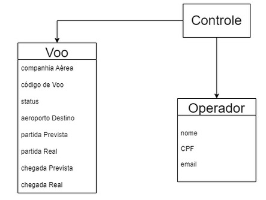
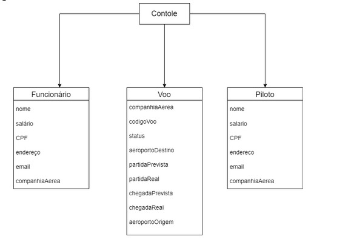
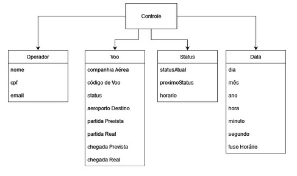

# Django WebApp PCS3643

## Informações do grupo

Grupo 5
* Augusto Vaccarelli
* Igor Caixeta
* Luiz Mota

## Esqueleto da Aplicação





## Arquivos adicionados
Arquivos adicionados com relação ao WebApp default do Django:

template
  -- first.html

## Instalação e Execução do Projeto
Para instalar o nosso projeto de PCS3643, basta realizar alguns comandos: 
</br>
</br>
1. ```git clone https://github.com/Flute-Gamer/Django-Webapp.git```
</br>
</br>
Para executar o projeto, é necessário estar na pasta do onde ele foi clonado ao rodar o comando: 
</br>
</br>
2. ```python manage.py runserver```
</br>
</br>

 Assim, existirá um link que é executado em um servidor local o qual pode ser aberto por qualquer navegador.