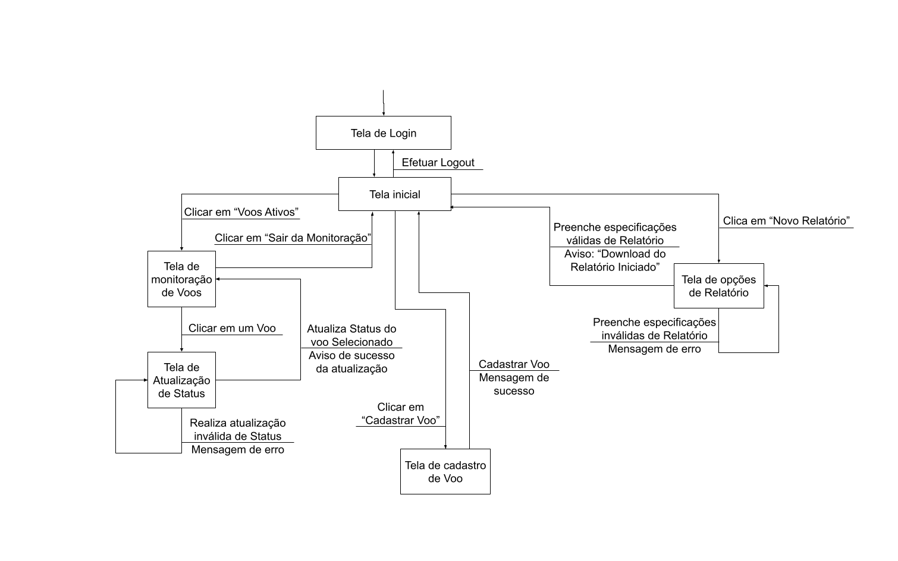

# Django WebApp PCS3643

## Informações do grupo

Grupo 5
* Augusto Vaccarelli
* Igor Caixeta
* Luiz Mota

## Esqueleto da Aplicação
### Diagrama Entidade Relacionamento

### Diagramas de Classe


### Diagrama de Navegação


## Arquivos adicionados
Arquivos adicionados com relação ao WebApp default do Django:


## Instalação e Execução do Projeto
Para instalar o nosso projeto de PCS3643, basta realizar alguns comandos: 
</br>
</br>
1.
 ```
 git clone https://github.com/Flute-Gamer/Django-Webapp.git
 ```
</br>
</br>
Para executar o projeto, é necessário ativar o ambiente no terminal: 
</br>
</br>
2.

 ```
 cd env/bin
 ```
</br>
</br>
3.

 ```
 .\Activate.ps1
 ``` 
 (para Windows) ou
</br>
3.
```
./activate
```
(para Linux)
</br>
</br>
Para executar o projeto, é necessário voltar à pasta onde ele foi clonado:
</br>
</br>
4. 
```
cd ..
```
 (duas vezes)
</br>
</br>
E rodar o comando: 
</br>
</br>
5.
 ```
 python manage.py runserver
 ```
</br>
</br>

 Assim, existirá um servidor local que pode ser aberto por qualquer navegador, pelo link:

 http://127.0.0.1:8000/login/auth

 Para rodar remotamente, há também um link para o deploy feito em PythonAnywhere:
 https://luizmota.pythonanywhere.com/login/auth

Para fazer Logout, clique na foto amigável no canto direito superior

 Boa sorte encontrando os logins e senhas no código-fonte ;)